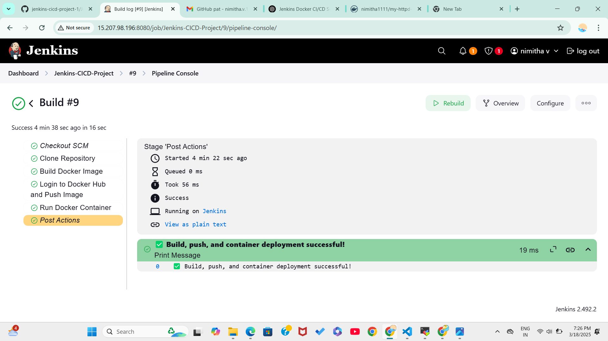
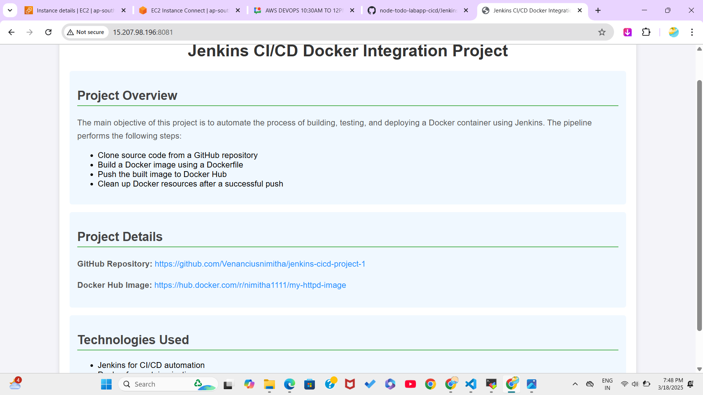

Here’s a complete `README.md` file for your project, including your output screenshot.

---

## 🚀 **Jenkins CI/CD Docker Integration Project**

This project demonstrates a complete **CI/CD pipeline** using **Jenkins**, **Docker**, and **GitHub**.

---

## 📚 **Project Overview**

The main objective of this project is to automate the process of building, testing, and deploying a Docker container using Jenkins. The pipeline performs the following steps:

1. ✅ Clone source code from a GitHub repository.  
2. ✅ Build a Docker image using a Dockerfile.  
3. ✅ Push the built image to Docker Hub.  
4. ✅ Clean up Docker resources after a successful push.  
5. ✅ Run a Docker container to serve the application.

---

## 🔗 **Project Details**

- **GitHub Repository:** [GitHub Repo Link](https://github.com/Venanciusnimitha/jenkins-cicd-project-1)  
- **Docker Hub Image:** [Docker Hub Image Link](https://hub.docker.com/r/nimitha1111/my-httpd-image)  

---

## 🖥️ **Technologies Used**

- 🛠️ Jenkins – For CI/CD automation  
- 🐳 Docker – For containerization  
- 📝 GitHub – For version control  
- ☁️ Docker Hub – For image hosting  

---

## 📄 **Project Structure**

```
/jenkins-cicd-project-1
├── Dockerfile
├── index.html
└── Jenkinsfile
```

### ➡️ **Dockerfile**
```Dockerfile
# Use official httpd image
FROM httpd:latest

# Copy the custom index.html
COPY index.html /usr/local/apache2/htdocs/
```

### ➡️ **Jenkinsfile**
```groovy
pipeline {
    agent any
    environment {
        DOCKER_IMAGE = "nimitha1111/my-httpd-image"
        DOCKER_TAG = "latest"
    }
    stages {
        stage('Clone Repository') {
            steps {
                checkout scm
            }
        }
        stage('Build Docker Image') {
            steps {
                sh 'docker build -t ${DOCKER_IMAGE}:${DOCKER_TAG} .'
            }
        }
        stage('Login to Docker Hub and Push Image') {
            steps {
                withDockerRegistry([credentialsId: 'docker-credentials', url: '']) {
                    sh 'docker push ${DOCKER_IMAGE}:${DOCKER_TAG}'
                }
            }
        }
        stage('Run Docker Container') {
            steps {
                sh '''
                docker stop my-httpd-container || true
                docker rm my-httpd-container || true
                docker run -d --name my-httpd-container -p 8081:80 ${DOCKER_IMAGE}:${DOCKER_TAG}
                '''
            }
        }
    }
    post {
        success {
            echo "✅ Build, push, and container deployment successful!"
        }
        failure {
            echo "❌ Build or deployment failed!"
        }
    }
}
```

---

## 🌐 **How to Run the Project**

### 1. **Clone the Repository**
```bash
git clone https://github.com/Venanciusnimitha/jenkins-cicd-project-1.git
```

### 2. **Update the `index.html` File**
Make any changes in your `index.html` file and save.

### 3. **Push the Changes to GitHub**
```bash
git add index.html
git commit -m "Updated index.html with latest changes"
git push origin main
```

### 4. **Trigger the Jenkins Pipeline**
- Open Jenkins Dashboard.
- Run the pipeline manually or enable webhook to trigger automatically after `git push`.

### 5. **View the Application**
- Go to:  
```
http://<your-ec2-ip>:8081
```

---

## 📸 **Output Screenshot**

Below is a screenshot of the successful deployment:

---

### Screenshot 1: Project Home Page


### Screenshot 2: Project Running in Browser


---

## 🧰 **Troubleshooting Tips**

- Check the Jenkins console logs for errors.
- Verify Docker and Jenkins services are running.
- Confirm correct credentials are used for Docker Hub.

---

## 📝 **Author**
- 🎯 **Name:** Nimitha V  
- 📧 **Email:** nimitha@example.com

---

🎉 **Project Completed Successfully!** 🚀

---

This README includes everything about your project with a reference to the screenshot. Let me know if you need any modifications! 😊